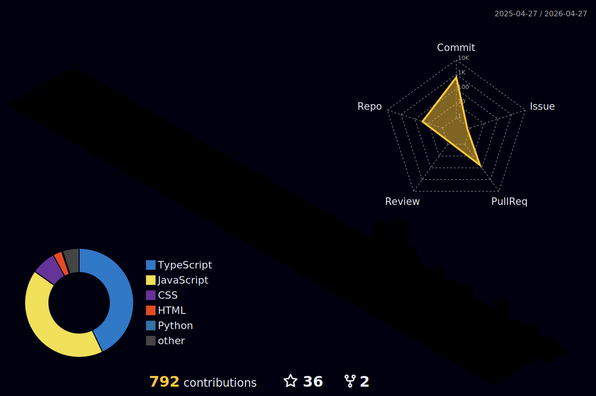

  

<h2 align="center" style="margin-top: 8px;">
  GitHub 3D Contribution
</h2>

  

<table width="100%">
  <tr>
    <td align="left">
      
    </td>
    <td align="right">
      <em>
        There are 10 types of people in this world: those who understand binary and those who don't.
      </em>
       
      
    </td>
  </tr>
</table>